# Texture-Synthesis

Texture Synthesis is the process of algorithmically constructing a large digital image from a small digital sample image by taking advantage of its structural content. It is an object of research in computer graphics and is used in many fields, amongst others digital image editing, 3D computer graphics and post-production of films.

Texture synthesis can be used to fill in holes in images (as in inpainting), create large non-repetitive background images and expand small pictures.

Here we implement an algorithm to create 2500x2500 textures based on small textures.

First, we set a size for our patch. All the images below are constructed using a patch size 150x150.

We select a random patch and put it on the top-left corner of the large texture for starting the process. After that, we consider a 30-pixel overlap for each neighbor pair of patches. Therefore we look for the best matches of the overlap region of the current patch and select randomly from the best ten places. After that, we find the minimum cut path of the overlap region, and we create a mask based on that so that it looks seamless.
 

    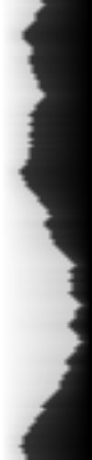
    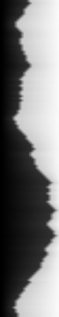

 
We repeat that process until we reach the next row. Here our overlap region is horizontal, but we apply the same procedure.
 

    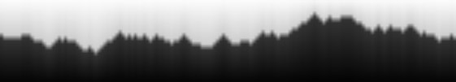
    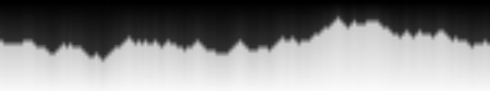

 

Now for our new patches, we have two overlaps. So we have to look for L shape matchings. So our final masks will look like this.
 

    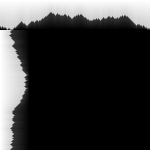
    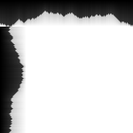

 

If we visualize this process, it would be almost identical to the image below.

    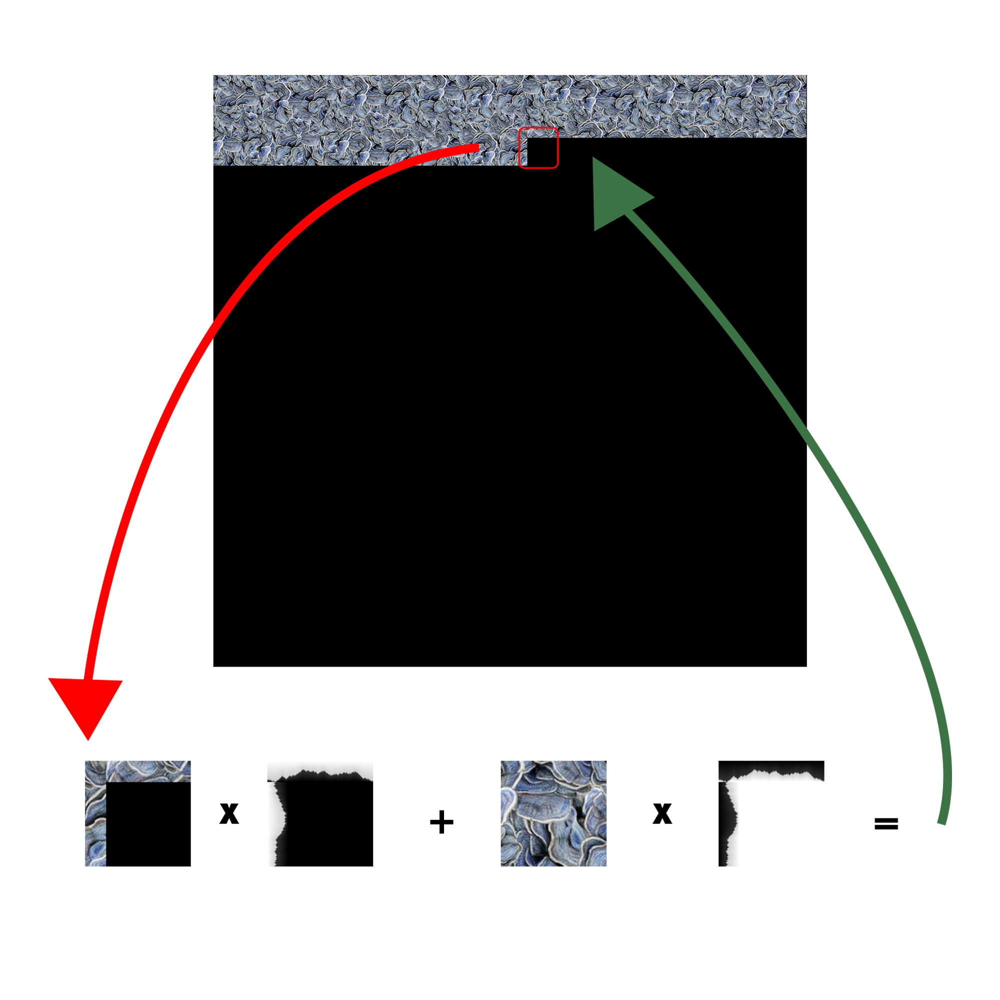

 

We apply the same procedure for each row and column until we reach the end of the image.

Here are some results of this implementation.

    
    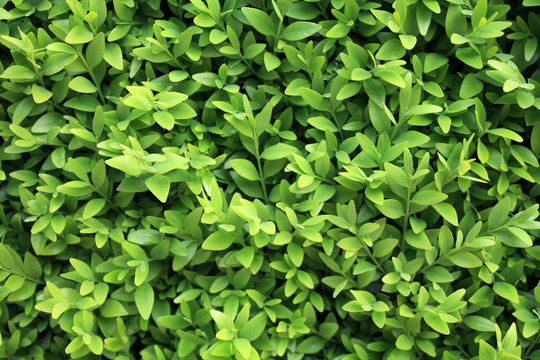

    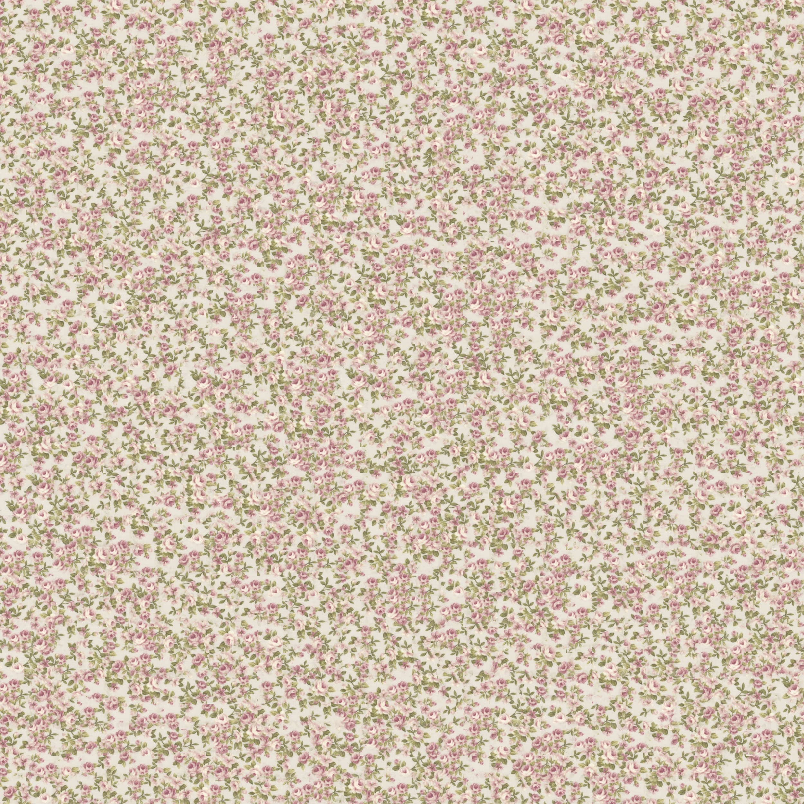
    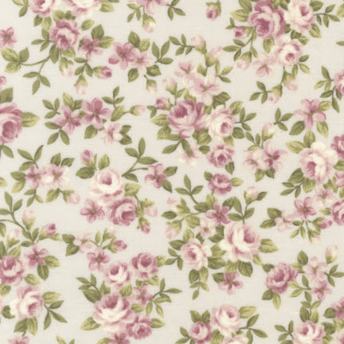

    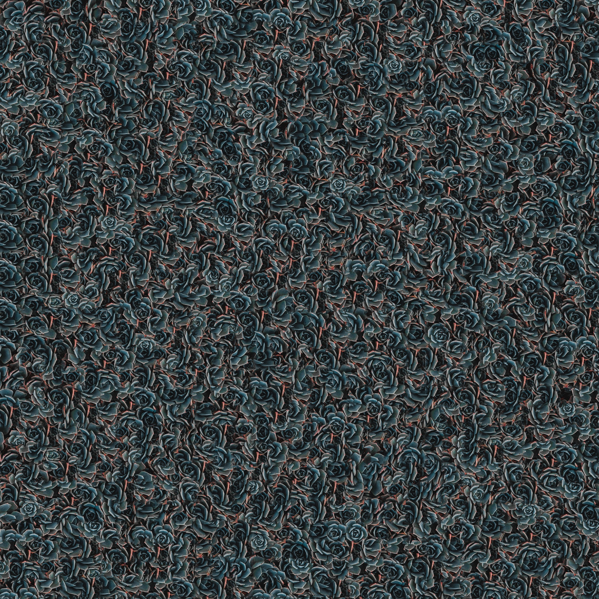
    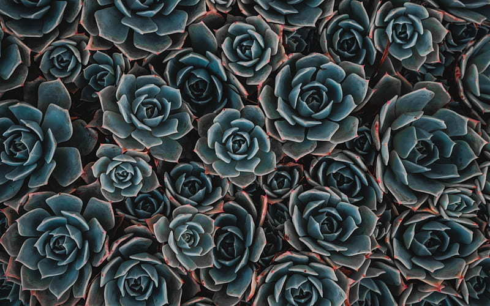

    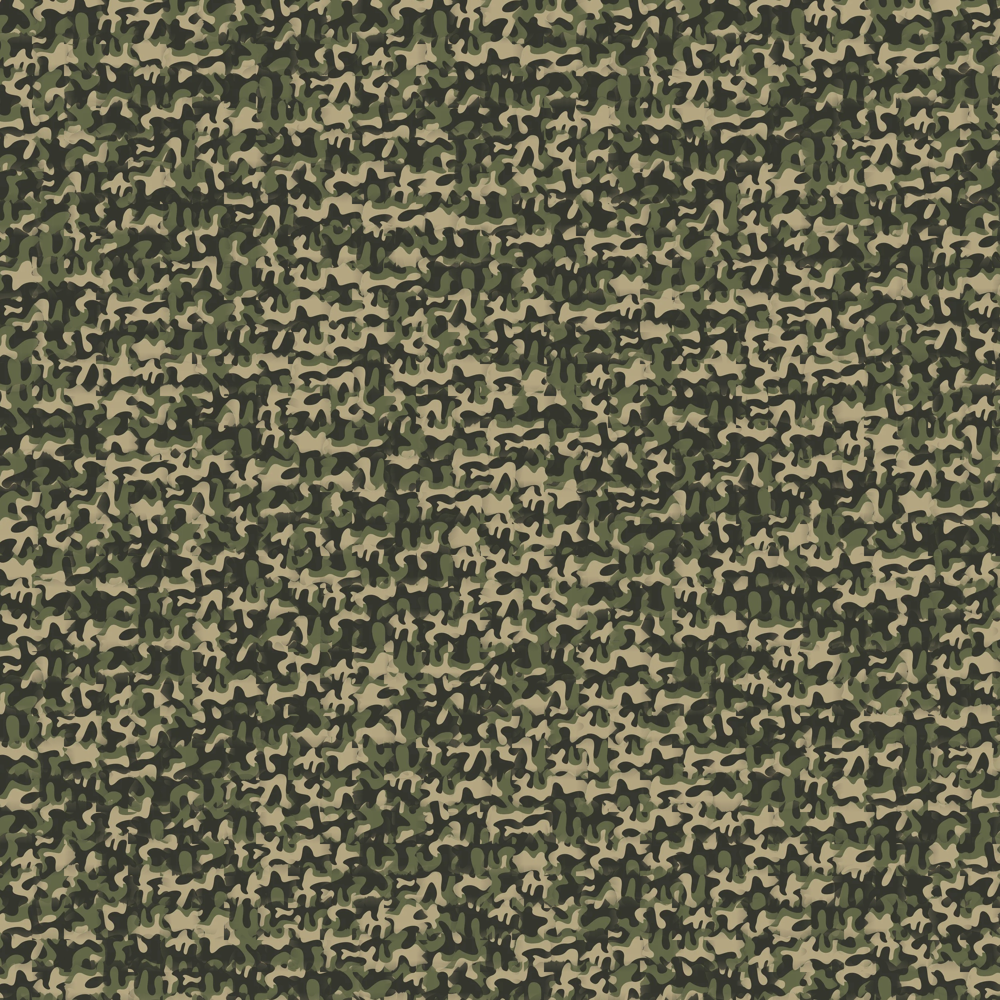
    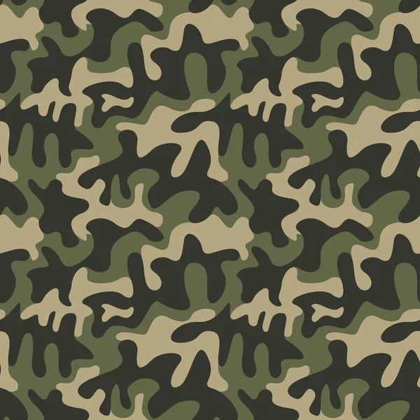

    
    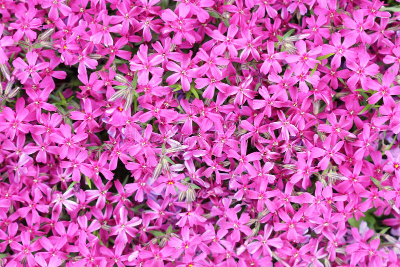

    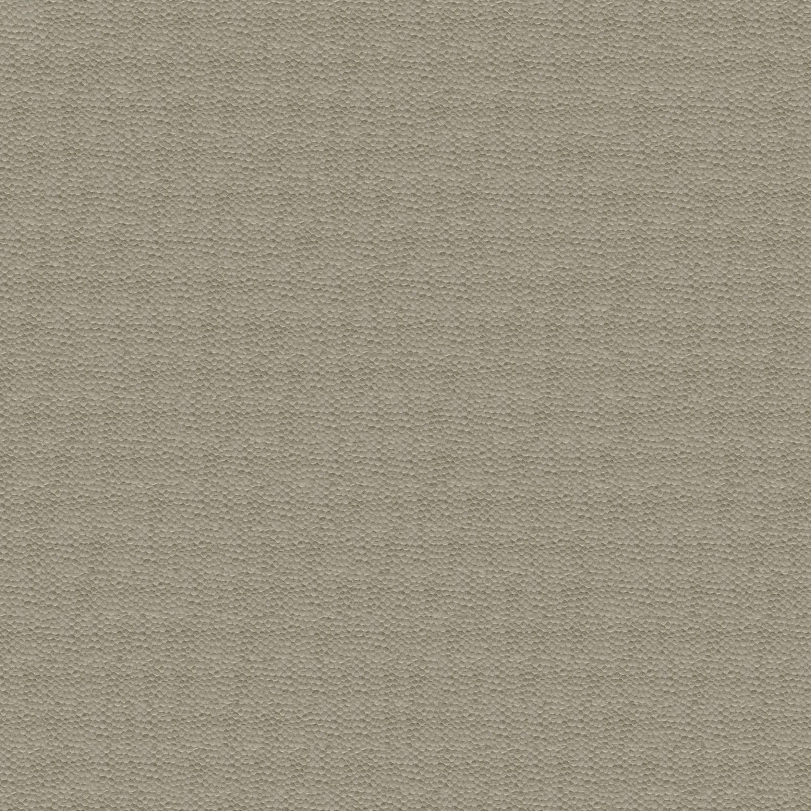
    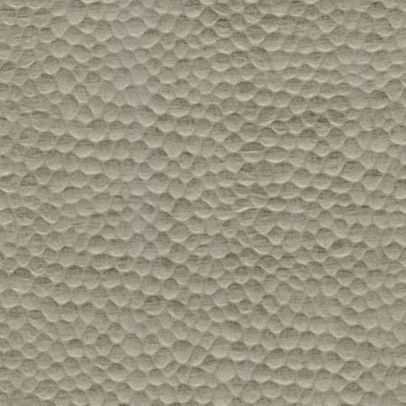

    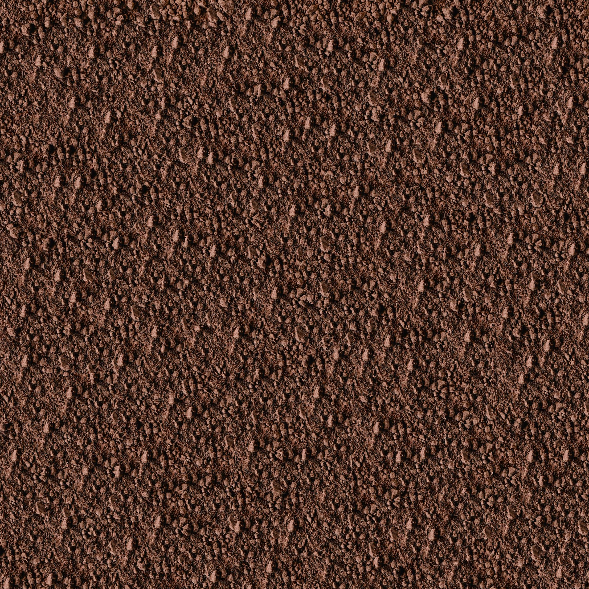
    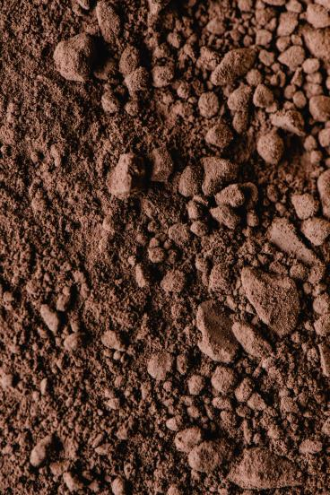

    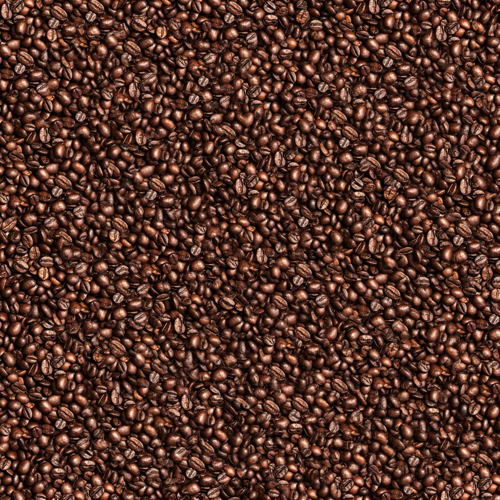
    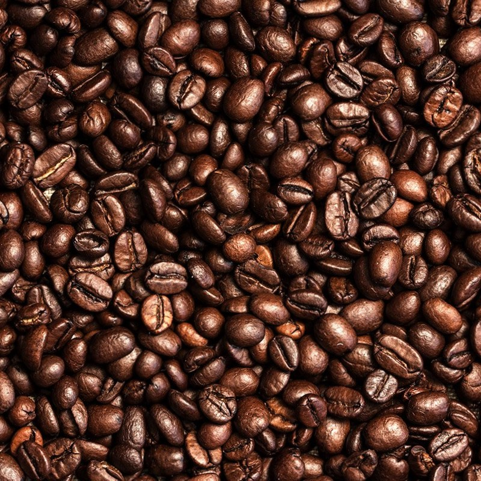

